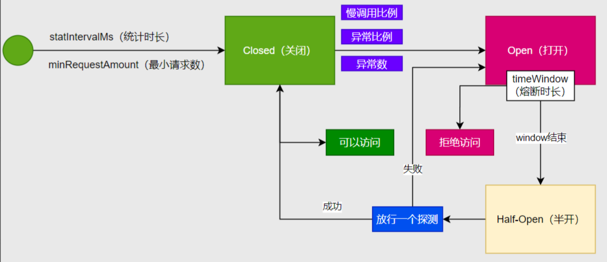

# SpringClod学习笔记

## Nacos

### 注册中心

#### 服务注册

1. 引入服务发现依赖

   ```xml
   <dependency>
       <groupId>com.alibaba.cloud</groupId>
       <artifactId>spring-cloud-starter-alibaba-nacos-discovery</artifactId>
   </dependency>
   ```

2. 在application.yml文件中配置nacos信息

   ```yml
   spring:
     cloud:
       nacos:
         server-addr: 127.0.0.1:8848
   ```

3. 启动nacos

   ```cmd
   startup.cmd -m standalone
   ```

4. 启动微服务

5. 在[nacos配置中心](http://localhost:8848/nacos)查看是否注册成功（服务管理 → 服务列表）

#### 服务发现

1. 在微服务的启动类添加注解 @EnableDiscoveryClient

2. 测试代码

   ```java
   @SpringBootTest
   public class ProductTest {
   
     @Autowired
     private DiscoveryClient discoveryClient;
   
     @Test
     public void testDiscoveryClient() {
       for (String service : discoveryClient.getServices()) {
         // 微服务名称
         System.out.println(service);
         // 微服务的ip+端口
         discoveryClient.getInstances(service)
             .forEach(instance -> System.out.println(instance.getHost() + "\t" + instance.getPort()));
       }
     }
   
   }
   ```

#### 服务调用

1. 引入负载均衡依赖

   ```xml
   <dependency>
     <groupId>org.springframework.cloud</groupId>
     <artifactId>spring-cloud-starter-loadbalancer</artifactId>
   </dependency>
   ```

2. 注册 RestTemplate 的 Bean ，加上 @LoadBalanced 注解

   ```java
   @Configuration
   public class RestTemplateConfig {
   
     // 注解式负载均衡
     @LoadBalanced
     @Bean
     RestTemplate restTemplate() {
       return new RestTemplate();
     }
   
   }
   ```

3. 调用服务

   ```java
   @Service
   public class OrderServiceImpl implements OrderService {
   
     @Autowired
     RestTemplate restTemplate;
   
     @Override
     public Order createOrder(int customerId, int productId, int quantity) {
   
       // ...
       
       // 调用其他服务
       // product-service 服务的名称
       // 向远程发送请求时，服务名称会被动态替换为对应机器的IP+Port
       String url = "http://product-service//product/" + productId;
       Product product = restTemplate.getForObject(url, Product.class);
       
       // ....
   
       return order;
     }
   }
   ```

### 配置中心

#### 导入配置

1. 引入配置中心依赖

   ```xml
   <dependency>
     <groupId>com.alibaba.cloud</groupId>
     <artifactId>spring-cloud-starter-alibaba-nacos-config</artifactId>
   </dependency>
   ```

2. 修改application.yml文件

   **如果import内导入了多个配置文件，先声明的优先，配置文件中的相同项不会被后续的文件覆盖**

   ```yml
   spring:
     cloud:
       nacos:
         server-addr: 127.0.0.1:8848
     # 导入配置中心的配置文件
     config:
       import: nacos:order-service.yml
   ```

   ```yml
   spring:
     cloud:
       nacos:
         server-addr: 127.0.0.1:8848
         #  关闭配置中心检查
         config:
           import-check:
             enabled: false
   ```

   

3. 在nacos配置中心创建新的配置文件

   **配置中心的配置文件的优先级高于项目内application.yml文件中的配置**

   1. 配置管理
   2. 配置列表
   3. 创建配置
   4. Data ID 输入在application.yml文件中记录的文件名称
   5. 设置配置文件的格式
   6. 输入配置文件的内容
   7. 发布

4. 获取方法

   ```java
     @Value("${order.timeout}")
     private String timeout;
   ```

5. 开启配置刷新功能，实时获取最新的配置文件的内容

   ```java
   @RefreshScope
   ```

6. **进阶写法**

   借助 ConfigurationProperties 实现自动刷新

   ```java
   @Component
   @ConfigurationProperties(prefix = "order")
   @Data
   public class OrderProperty {
   
     private String timeout;
     private String autoConfirm;
   }
   ```

7. 实时监听配置中心的指定配置文件的内容变化(在启动器类加入)

   ```java
     @Bean
     ApplicationRunner runner(NacosConfigManager manager) {
       return args -> {
         ConfigService configService = manager.getConfigService();
         configService.addListener("order-service.yml", "DEFAULT_GROUP", new Listener() {
           @Override
           public Executor getExecutor() {
             return Executors.newFixedThreadPool(2);
           }
   
           @Override
           public void receiveConfigInfo(String configInfo) {
             System.out.println("========》" + LocalDateTime.now() + "\t配置信息发生变化:《========");
             System.out.println(configInfo);
             System.out.println("============================》《============================");
           }
         });
       };
     }
   ```

#### 数据隔离

使用**名称空间（namespace）**区分不同的环境

使用**组（group）**区分不同的微服务

使用**配置文件（Data id）**区分不同的配置 

```yml
spring:
  application:
    name: order-service
  # 指定当前环境
  profiles:
    active: prod
  cloud:
    nacos:
      server-addr: 127.0.0.1:8848
      config:
        # 关闭配置中心检查
        import-check:
          enabled: false
        # 指定命名空间。默认使用public
        namespace: ${spring.profiles.active:public}

---
spring:
  config:
    import:
      - nacos:common.yml?group=order
      - nacos:db.yml?group=order
    activate:
      on-profile: dev

---
spring:
  config:
    import:
      - nacos:common.yml?group=order
      - nacos:db.yml?group=order
      - nacos:test.yml?group=order
    activate:
      on-profile: test

---
spring:
  config:
    import:
      - nacos:common.yml?group=order
      - nacos:db.yml?group=order
      - nacos:prod.yml?group=order
    activate:
      on-profile: prod
```


## OpenFeign

### 远程调用

1. 引入openFeign依赖

   ```xml
   <dependency>
     <groupId>org.springframework.cloud</groupId>
     <artifactId>spring-cloud-starter-openfeign</artifactId>
   </dependency>
   ```

2. 在启动类加入注解 

   ```java
   @EnableFeignClients
   ```

3. 创建FeignClient

   ```java
   @FeignClient(value = "product-service")
   public interface ProductFeignClient {
   
     // 此时GetMapping表示发起GET请求
     @GetMapping("/product/{productId}")
     Product getProduct(@PathVariable int productId);
   
   }
   ```

4. 通过FeignClient调用其他服务

   ```java
   @Service
   public class OrderServiceImpl implements OrderService {
   
     @Autowired
     ProductFeignClient productFeignClient;
   
     @Override
     public Order createOrder(int customerId, int productId, int quantity) {
   
       // ...
       Product product = productFeignClient.getProduct(productId);
       // ...
   
       return order;
     }
   }
   ```

5.  第三方API接口

   ```java
   // 远程调用第三方接口时，value任意（不能和现有重复）,url需要正确填写
   // https://jsonplaceholder.typicode.com/posts
   // url：https://jsonplaceholder.typicode.com
   // 参数：/posts
   @FeignClient(value = "another-blog-service", url = "https://jsonplaceholder.typicode.com")
   public interface AnotherFeignClient {
   
     @GetMapping("/posts")
     String getBlogList(@RequestHeader("Authorization") String auth,
         @RequestParam("token") String token, @RequestParam("page") int page);
   }
   ```

### 开启日志

1. 修改application.yml

   ```yml
   logging:
     level:
       com.zero.order.feign : debug
   ```

2. 修改配置类

   ```java
   import feign.Logger;
   import org.springframework.context.annotation.Bean;
   import org.springframework.context.annotation.Configuration;
   
   @Configuration
   public class OrderConfig {
   
     // 开启Feign日志
     @Bean
     Logger.Level getLevel() {
       return Logger.Level.FULL;
     }
   }
   ```

### 超时配置

1. 修改application.yml文件

   ```yml
   # openfeign 配置
   feign:
     client:
       config:
         # 默认配置
         default:
           logger-level: full
           connect-timeout: 2000
           read-timeout: 2000
         # 指定feign客户端配置
         product-service:
           logger-level: full
           connect-timeout: 5000
           read-timeout: 5000
   ```

   

### 重试机制

1. 修改配置类

   ```java
   // 开启Feign重试机制
   @Bean
   Retryer getRetryer() {
   	return new Retryer.Default();
   }
   ```

   

### 拦截器

#### 请求拦截器

- 作用

  - 给远程服务发送请求前，对请求进行拦截，可在此做一些修改，比如修改请求头等..

  ```java
  @Component
  public class XTokenRequestInterceptor implements RequestInterceptor {
  
    /**
     * 请求拦截器
     * @param template 请求模板
     */
    @Override
    public void apply(RequestTemplate template) {
      System.out.println("请求拦截器拦截到请求");
      template.header("X-Token", "123456");
    }
  }
  ```

  

#### 响应拦截器

- 作用
  - 对远程服务的响应数据进行修改


### 兜底返回

1. 实现FeignClient接口

   ```java
   @Component
   public class ProductFeignClientFallback implements ProductFeignClient {
   
     @Override
     public Product getProduct(int productId) {
       Product product = new Product();
       product.setProductId(productId);
       product.setName("未知商品");
       product.setPrice(0);
       return product;
     }
   
   }
   ```

2. 将接口实现类设置为fallback

   ```java
   @FeignClient(value = "product-service", fallback = ProductFeignClientFallback.class)
   public interface ProductFeignClient {
   
     // 此时GetMapping表示发起GET请求
     @GetMapping("/product/{productId}")
     Product getProduct(@PathVariable int productId);
   
   }
   ```

3. 引入Sentinel依赖

   ```xml
   <dependency>
     <groupId>com.alibaba.cloud</groupId>
     <artifactId>spring-cloud-starter-alibaba-sentinel</artifactId>
   </dependency>
   ```

4. 修改application.yml，开启熔断

   ```yml
   # openfeign 配置
   feign:
     # 开启服务熔断
     sentinel:
       enabled: true
   ```

   

## Sentinel

1. 引入Sentinel依赖

   ```xml
   <dependency>
     <groupId>com.alibaba.cloud</groupId>
     <artifactId>spring-cloud-starter-alibaba-sentinel</artifactId>
   </dependency>
   ```

2. 修改application.yml文件

   ```yml
   spring:
     cloud:
       sentinel:
         transport:
           # sentinel 控制台
           dashboard: localhost:8080
         # 开启提前加载
         eager: true
   ```

### 异常处理

#### Web接口异常

```java
/**
 * Web接口被Sentinel限制后的自定义异常处理
 */
@Component
public class MyBlockException implements BlockExceptionHandler {

  @Override
  public void handle(HttpServletRequest request, HttpServletResponse response, BlockException e)
      throws Exception {
    ObjectMapper objectMapper = new ObjectMapper();
    objectMapper.setDefaultPropertyInclusion(JsonInclude.Include.NON_NULL);
    response.setContentType("application/json;charset=UTF-8");
    PrintWriter writer = response.getWriter();
    R.error(500, e.getMessage());
    writer.write(objectMapper.writeValueAsString(R.error(500, "违反Sentinel的流控规则，禁止访问")));
    writer.flush();
    writer.close();
  }
}
```

#### @SentinelResource修饰的方法发生流控异常

```java
@Service
@Slf4j
public class OrderServiceImpl implements OrderService {

  @Autowired
  ProductFeignClient productFeignClient;

  // 使用 blockHandler 标注降级处理方法
  @SentinelResource(value = "createOrder", blockHandler = "createOrderFallback")
  @Override
  public Order createOrder(int customerId, int productId, int quantity) {
      // ......
  }

  /**
   * 降级处理方法
   */
  public Order createOrderFallback(int customerId, int productId, int quantity, BlockException e) {
     // ......
  }

}
```

**若不需要降级处理，则使用全局异常处理类进行处理**


#### OpenFeign调用发生流控异常

此时首先会调用该方法的降级处理方法，如果没有进行降级处理，则需要使用全局异常处理类进行处理


#### Sphu.xxx() 出现流控异常

手动使用 try.. catch 解决


### 流控规则

#### 阈值类型

1. **QPS（Queries Per Second）**：
   - 控制每秒的请求数量。
   - 适用于限制接口或资源的请求频率。
2. **线程数**：
   - 控制并发线程数。
   - 适用于限制同时处理请求的线程数量，防止资源耗尽。

#### 均摊阈值

是指将总阈值均匀分摊到每个小周期中，从而实现更平滑的流量控制

#### 集群阈值模式

- 情况A：

  - 阈值类型：QPS
  - 均摊阈值：5
  - 集群阈值模式：单机均摊
  - 集群内主机数量：3个，且所有主机都包含当前被限制的簇点链路。

- 解释：

  - 每个主机的 QPS 限制为 5，即每秒最多处理 5 个请求。

  - 由于是单机均摊模式，集群中的每个主机独立计算 QPS，互不影响。

  - 如果某个主机的 QPS 超过 5，Sentinel 会对该主机的请求进行限流，而其他主机不受影响。

    

- 情况B：

  - 阈值类型：QPS
  - 均摊阈值：10
  - 集群阈值模式：总体阈值
  - 集群内主机数量：3个，且所有主机都包含当前被限制的簇点链路。

- 解释：

  - 整个集群的 QPS 限制为 10，即集群中所有主机每秒处理的请求总数不能超过 10。
  - 由于是总体阈值模式，集群中的主机共享 QPS 限制，所有主机的请求量会累加计算。
  - 如果集群的 QPS 超过 10，Sentinel 会对集群中的请求进行限流。

#### 流控模式

1. 直接模式

   - 定义：直接对某个资源（如接口、方法等）进行流量限制。
   - 特点：
     - 独立限制：只针对当前资源的流量进行控制，与其他资源无关。
     - 简单直接：适用于单个资源的流量控制。
   - 示例：
     - 设置某个接口的 QPS 阈值为 10，超过 10 的请求会被限流。
     - 例如：`/api/user` 接口的 QPS 限制为 10，超过 10 的请求会被拒绝。

2. 关联模式

   - 定义：根据某个关联资源的流量状态，对当前资源进行流量限制。

   - 特点：

     - 关联控制：当前资源的流量限制依赖于另一个关联资源的流量状态。
     - 优先级：当关联资源的流量达到阈值时，才会对当前资源进行限流。

   - 示例：

     - 设置资源 A 的 QPS 阈值为 10，并关联资源 B。
     - 当资源 B 的 QPS 超过 10 时，资源 A 会被限流，即使资源 A 本身的流量未达到阈值。

   - 注意点：

     - 需要修改application.yml文件

       ```yml
       spring:
         cloud:
           sentinel:
             # 控制 Sentinel 是否统一处理 Web 请求的上下文
             web-context-unify: false
       ```

3. 链路模式

   - 定义：根据某个调用链路（入口资源）的流量状态，对当前资源进行流量限制。
   - 特点：
     - 链路控制：只对通过特定入口资源调用当前资源的流量进行限制。
     - 入口资源：需要指定一个入口资源（Entry Resource），只有通过该入口调用的流量才会被统计和限制。
   - 示例：
     - 设置资源 A 的 QPS 阈值为 10，并指定入口资源为 `/api/entry`。
     - 只有当通过 `/api/entry` 调用资源 A 的流量超过 10 时，才会对资源 A 进行限流。
     - 通过其他入口调用资源 A 的流量不会被统计和限制。

#### 流控效果

1. 快速失败（快速拒绝）
   - 定义：当流量超过阈值时，立即拒绝请求，并抛出 `FlowException` 异常。
   - 特点：
     - 简单直接：无需等待，直接拒绝请求。
     - 适合突发流量：能够快速保护系统，避免过载。
   - 实现原理：
     - 当 QPS 或并发数超过阈值时，直接拒绝请求，返回错误信息。
   - 示例：
     - 设置 QPS 阈值为 10，当每秒请求数超过 10 时，直接拒绝后续请求。
2. Warm Up（预热）
   - 定义：当流量超过阈值时，允许请求通过，但会逐步增加允许的流量，直到达到设定的阈值。
   - 特点：
     - 平滑过渡：避免系统在冷启动时被突发流量打垮。
     - 适合冷启动场景：例如系统刚启动时，资源尚未完全初始化，需要逐步增加流量。
   - 实现原理：
     - Sentinel 使用令牌桶算法，在预热时间内逐步增加允许的流量。
     - 预热时间内，实际允许的 QPS 会从较低值逐步增加到设定的阈值。
   - 示例：
     - 设置 QPS 阈值为 100，预热时间为 10 秒。
     - 在 10 秒内，允许的 QPS 会从 50 逐步增加到 100。
3. 排队等待
   - 定义：当流量超过阈值时，请求不会被立即拒绝，而是进入队列等待，直到超时或通过。
   - 特点：
     - 请求排队：通过排队的方式，尽量让请求通过，而不是直接拒绝。
     - 适合流量波动场景：能够在一定程度上缓解突发流量。
   - 实现原理：
     - Sentinel 使用漏桶算法，将请求放入队列中，按照固定的速率处理请求。
     - 如果请求在队列中等待超时，则会被拒绝。
   - 示例：
     - 设置 QPS 阈值为 10，超时时间为 500ms。
     - 当每秒请求数超过 10 时，请求会进入队列等待，最多等待 500ms。
     - 如果 500ms 内请求仍未通过，则会被拒绝。

#### 熔断降级



1. 慢调用比例
   - 定义：当资源的慢调用比例（即响应时间超过设定阈值的请求比例）超过设定的阈值时，触发熔断。
   - 特点：
     - 基于响应时间：关注请求的响应时间是否过长。
     - 适合性能敏感场景：用于保护系统免受慢调用的影响。
   - 参数：
     - 慢调用比例阈值：例如 0.5，表示慢调用比例超过 50% 时触发熔断。
     - 最大 RT（响应时间）：例如 500ms，表示响应时间超过 500ms 的请求被视为慢调用。
     - 统计时长：例如 10s，表示统计最近 10 秒内的请求。
     - 最小请求数：例如 5，表示在统计时长内至少需要 5 个请求才触发熔断。
     - 熔断时长：例如 5s，表示熔断持续 5 秒，之后进入半开状态。
   - 示例：
     - 设置最大 RT 为 500ms，慢调用比例阈值为 0.5，统计时长为 10s，最小请求数为 5，熔断时长为 5s。
     - 如果最近 10 秒内有 5 个请求，且其中 3 个请求的响应时间超过 500ms（慢调用比例为 60%），则触发熔断。
2. 异常比例
   - 定义：当资源的异常比例（即请求抛出异常的比例）超过设定的阈值时，触发熔断。
   - 特点：
     - 基于异常数：关注请求是否抛出异常。
     - 适合异常敏感场景：用于保护系统免受异常请求的影响。
   - 参数：
     - 异常比例阈值：例如 0.5，表示异常比例超过 50% 时触发熔断。
     - 统计时长：例如 10s，表示统计最近 10 秒内的请求。
     - 最小请求数：例如 5，表示在统计时长内至少需要 5 个请求才触发熔断。
     - 熔断时长：例如 5s，表示熔断持续 5 秒，之后进入半开状态。
   - 示例：
     - 设置异常比例阈值为 0.5，统计时长为 10s，最小请求数为 5，熔断时长为 5s。
     - 如果最近 10 秒内有 5 个请求，且其中 3 个请求抛出异常（异常比例为 60%），则触发熔断。
3. 异常数
   - 定义：当资源的异常数（即请求抛出异常的数量）超过设定的阈值时，触发熔断。
   - 特点：
     - 基于异常数：关注请求是否抛出异常。
     - 适合异常敏感场景：用于保护系统免受异常请求的影响。
   - 参数：
     - 异常数阈值：例如 3，表示异常数超过 3 时触发熔断。
     - 统计时长：例如 10s，表示统计最近 10 秒内的请求。
     - 熔断时长：例如 5s，表示熔断持续 5 秒，之后进入半开状态。
   - 示例：
     - 设置异常数阈值为 3，统计时长为 10s，熔断时长为 5s。
     - 如果最近 10 秒内有 3 个请求抛出异常，则触发熔断。

#### 热点规则

​	热点规则的核心思想是：**针对某些特定的参数值或参数组合，单独设置流量限制**，而不是对整个资源进行统一的限制。

1. **资源名：**需要被保护的资源，例如某个接口或方法。
2. **参数索引：**指定需要监控的参数位置（从 0 开始）
   - 如果接口方法为 `getUserInfo(Long userId, String ip)`，则 `userId` 的参数索引为 0，`ip` 的参数索引为 1。
3. **单机阈值：**针对指定参数值的流量限制（QPS ）。
4. **统计窗口时长：**统计流量的时间窗口，单位为秒。
5. **参数例外项**
   - **参数类型**：参数的数据类型
   - **参数值**：指定例外情况参数的具体参数值
   - **限流阈值：**针对指定参数值的流量限制（QPS）

下单场景：

- 接口

  - sec-order?customerId=xxx&productId=xxxx

  - ```java
      @GetMapping("/sec-order")
      @SentinelResource(value = "secondOrder-sentinel", fallback = "CreateSecondOrderFallback")
      public Order CreateSecondOrder(@RequestParam int customerId, @RequestParam int productId) {
        // ......
      }
      
      public Order CreateSecondOrderFallback(int customerId, int productId, Throwable e) {
        // ......
      }
    ```

- 秒杀订单，每个用户的QPS不能超过1。
  - 参数索引：0
  - 单机阈值：1
  - 统计窗口时长：1
- customerId为666的用户是VIP用户，不限制QPS。
  - 参数索引：0
  - 单机阈值：1
  - 统计窗口时长：1
  - 参数例外项：
    - 参数类型：int
    - 参数值：666
    - 限流阈值：1000
- productId为888的商品已经下架，不允许访问。
  - 参数索引：1
  - 单机阈值：1000
  - 统计窗口时长：1
  - 参数例外项：
    - 参数类型：int
    - 参数值：888
    - 限流阈值：0

## Gateway

1. 引入依赖

   ```xml
   <dependency>
     <groupId>com.alibaba.cloud</groupId>
     <artifactId>spring-cloud-starter-alibaba-nacos-discovery</artifactId>
   </dependency>
   <dependency>
     <groupId>org.springframework.cloud</groupId>
     <artifactId>spring-cloud-starter-gateway</artifactId>
   </dependency>
   ```

2. 书写启动类

   ```java
   @SpringBootApplication
   @EnableDiscoveryClient
   public class GatewayApplication {
   
     public static void main(String[] args) {
       SpringApplication.run(GatewayApplication.class, args);
     }
   }
   ```

   

3. 修改application.yml文件

   ```yml
   server:
     port: 80
   
   spring:
     application:
       name: gateway
     cloud:
       nacos:
         server-addr: localhost:8848
       gateway:
         routes:
           - id: product-service
             uri: lb://product-service
             predicates:
               - Path=/api/product/**
             filters:
               # 移除路径的前两个前缀
               - StripPrefix=2
           - id: order-service
             uri: lb://order-service
             predicates:
               - name: Path
                 args:
                   - patterns: /api/order/**
                   # 是否匹配尾部斜杠
                   - matchTrailingSlash: true
             filters:
               # 移除路径的前两个前缀
               - StripPrefix=2
   ```
   

### 自定义断言

1. 命名必须为**xxxRoutePredicateFactory**

   ```java
   @Component
   public class UserRoutePredicateFactory extends AbstractRoutePredicateFactory<UserRoutePredicateFactory.Config> {
   
     public UserRoutePredicateFactory() {
       super(UserRoutePredicateFactory.Config.class);
     }
   
     @Override
     public List<String> shortcutFieldOrder() {
       return Arrays.asList("param", "value");
     }
   
     // 自定义验证逻辑
     @Override
     public Predicate<ServerWebExchange> apply(Config config) {
       return serverWebExchange -> {
         ServerHttpRequest request = serverWebExchange.getRequest();
         String first = request.getQueryParams().getFirst(config.param);
         return StringUtils.hasText(first) && first.equals(config.value);
       };
     }
   
   
     @Validated
     public static class Config {
   
       @NotEmpty
       private String param;
   
       @NotEmpty
       private String value;
   
       //get set
   
     }
   
   }
   ```

2. 在application.yml文件中使用的时候只需要输入 xxx的部分

   ```yml
   spring:
     cloud:
       nacos:
         server-addr: localhost:8848
       gateway:
         routes:
           - id: baidu-service
             uri: https://www.baidu.com
             predicates:
               - name: User
                 args:
                   param: name
                   value: silence
   
   ```

### 过滤器

| 名                               | 参数（个数/类型） | 作用                                              |
| -------------------------------- | ----------------- | ------------------------------------------------- |
| AddRequestHeader                 | 2/string          | 添加请求头                                        |
| AddRequestHeadersIfNotPresent    | 1/List、string    | 如果没有则添加请求头，key:value方式               |
| AddRequestParameter              | 2/string、string  | 添加请求参数                                      |
| AddResponseHeader                | 2/string、string  | 添加响应头                                        |
| CircuitBreaker                   | 1/string          | 仅支持forward:/inCaseOfFailureUseThis方式进行熔断 |
| CacheRequestBody                 | 1/string          | 缓存请求体                                        |
| DedupeResponseHeader             | 1/string          | 移除重复响应头，多个用空格分割                    |
| FallbackHeaders                  | 1/string          | 设置Fallback头                                    |
| JsonToGrpc                       |                   | 请求体Json转为gRPC                                |
| LocalResponseCache               | 2/string          | 响应数据本地缓存                                  |
| MapRequestHeader                 | 2/string          | 把某个请求头名字变为另一个名字                    |
| ModifyRequestBody                | 仅 Java 代码方式  | 修改请求体                                        |
| ModifyResponseBody               | 仅 Java 代码方式  | 修改响应体                                        |
| PrefixPath                       | 1/string          | 自动添加请求前缀路径                              |
| PreserveHostHeader               | 0                 | 保护Host头                                        |
| RedirectTo                       | 3/string          | 重定向到指定位置                                  |
| RemoveJsonAttributesResponseBody | 1/string          | 移除响应体中的某些Json字段，多个用,分割           |
| RemoveRequestHeader              | 1/string          | 移除请求头                                        |
| RemoveRequestParameter           | 1/string          | 移除请求参数                                      |
| RemoveResponseHeader             | 1/string          | 移除响应头                                        |
| RequestHeaderSize                | 2/string          | 设置请求大小，超出则响应431状态码                 |
| RequestRateLimiter               | 1/string          | 请求限流                                          |
| RewriteLocationResponseHeader    | 4/string          | 重写Location响应头                                |
| RewritePath                      | 2/string          | 路径重写                                          |
| RewriteRequestParameter          | 2/string          | 请求参数重写                                      |
| RewriteResponseHeader            | 3/string          | 响应头重写                                        |
| SaveSession                      | 0                 | session保存，配合spring-session框架               |
| SecureHeaders                    | 0                 | 安全头设置                                        |
| SetPath                          | 1/string          | 路径修改                                          |
| SetRequestHeader                 | 2/string          | 请求头修改                                        |
| SetResponseHeader                | 2/string          | 响应头修改                                        |
| SetStatus                        | 1/int             | 设置响应状态码                                    |
| StripPrefix                      | 1/int             | 路径层级拆除                                      |
| Retry                            | 7/string          | 请求重试设置                                      |
| RequestSize                      | 1/string          | 请求大小限定                                      |
| SetRequestHostHeader             | 1/string          | 设置Host请求头                                    |
| TokenRelay                       | 1/string          | OAuth2的token转发                                 |

#### 全局过滤器

```java
/**
 * 全局过滤器，响应时间过滤器
 */
@Component
@Slf4j
public class ResponseTimeGlobalFilter implements GlobalFilter, Ordered {

  /**
   * 过滤器处理逻辑
   */
  @Override
  public Mono<Void> filter(ServerWebExchange exchange, GatewayFilterChain chain) {
    String requestUri = exchange.getRequest().getURI().toString();
    long start = System.currentTimeMillis();
    log.info("==========请求「{}」开始==========", requestUri);

    return chain.filter(exchange).doFinally(signalType -> {
      long end = System.currentTimeMillis();
      log.info("==========请求「{}」结束，耗时{}s==========", requestUri, (end - start) * 1.0 / 1000);
    });
  }

  /**
   * 设置过滤器优先级，越小越靠前
   */
  @Override
  public int getOrder() {
    return 0;
  }
}
```

#### 自定义过滤器工厂

1. 命名规则：**xxxxGatewayFilterFactory**

   ```java
   @Component
   public class AddCustomTokenGatewayFilterFactory extends AbstractNameValueGatewayFilterFactory {
   
     @Override
     public GatewayFilter apply(NameValueConfig config) {
       return (exchange, chain) -> chain.filter(exchange).then(Mono.fromRunnable(() -> {
         ServerHttpResponse response = exchange.getResponse();
         HttpHeaders headers = response.getHeaders();
         String value = config.getValue();
         String token = "";
         if ("uuid".equals(value)) {
           token = UUID.randomUUID().toString();
         } else if ("jwt".equals(value)) {
           token = "假装是个jwt";
         } else {
           token = String.valueOf(System.currentTimeMillis());
         }
         headers.add(config.getName(), token);
       }));
     }
   }
   ```

2. 在application.yml文件中使用

   ```yml
   server:
     port: 80
   
   spring:
     application:
       name: gateway
     cloud:
       nacos:
         server-addr: localhost:8848
       gateway:
         routes:
           - id: order-service
             uri: lb://order-service
             predicates:
               - name: Path
                 args:
                   - patterns: /api/order/**
             filters:
               - AddCustomToken=customToken,uuid
   ```

#### 全局跨域

```yml
spring:
  application:
    name: gateway
  cloud:
    nacos:
      server-addr: localhost:8848
    gateway:
      # 跨域配置
      globalcors:
        cors-configurations:
          '[/**]':
            allowed-origin-patterns: "*"
            allowed-headers: "*"
            allowed-methods: "*"
```

